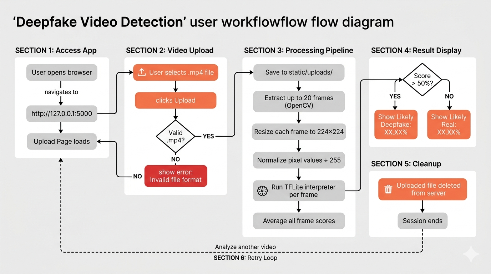

# FrameTruth

Production-oriented deepfake video forensics for frame-level analysis, operator observability, and secure API delivery.

**Stack:** Python, Flask, TensorFlow Lite, React, SQLite, Docker, Prometheus, Grafana

FrameTruth analyzes uploaded or URL-sourced videos by sampling frames, running ensemble TFLite inference, and returning a forensic result payload with frame timelines, suspicious timestamps, temporal consistency metrics, secondary forensic signals, operator analytics, and exportable PDF reporting.

## Contents

- [Overview](#overview)
- [System Architecture](#system-architecture)
- [User Flow](#user-flow)
- [Core Capabilities](#core-capabilities)
- [Quick Start](#quick-start)
- [Docker Deployment](#docker-deployment)
- [Configuration](#configuration)
- [API Reference](#api-reference)
- [Observability](#observability)
- [Security](#security)
- [Validation Pipeline](#validation-pipeline)
- [Testing](#testing)
- [Research Context](#research-context)
- [Project Structure](#project-structure)
- [Operational Notes](#operational-notes)
- [Roadmap](#roadmap)
- [License](#license)

## Overview

FrameTruth is designed as a small but production-shaped deepfake detection system rather than a single-model demo. The repository includes:

- JWT-based authentication with role-aware access control
- asynchronous analysis jobs with polling endpoints
- structured JSON logging and request tracing
- Prometheus-compatible service metrics
- Grafana and Prometheus provisioning for monitoring
- operator analytics endpoints and dashboard views
- forensic secondary signals beyond the base model score
- PDF report generation for completed analyses

The application uses an ensemble of bundled TensorFlow Lite models and augments their output with temporal consistency, optical flow, frequency-domain scoring, landmark displacement heuristics, and an audio-visual sync proxy.

## System Architecture


## User Flow



## Core Capabilities

| Capability | Description |
|---|---|
| Ensemble TFLite inference | Uses both bundled `.tflite` models to score sampled frames and compute disagreement |
| Frame timeline analysis | Returns full per-frame probabilities for frontend charting and suspicious marker rendering |
| Temporal consistency | Computes variance and standard deviation across frame scores to expose instability |
| Async processing | `POST /api/v1/analyze` returns a `job_id` immediately; clients poll for progress and results |
| Auth and RBAC | JWT auth with `analyst`, `operator`, and `admin` roles |
| Observability | `/metrics`, `/health`, JSON logs, request IDs, analytics history, Grafana provisioning |
| Input validation | File size, duration, readable-frame, and MP4/MOV signature checks before inference |
| URL ingestion | Public video URL ingestion through `yt-dlp`, subject to duration limits |
| Exportable reports | Generates per-analysis PDF reports with verdicts, charts, top suspicious frames, and a final review of every sampled frame with fake-confidence percentages |
| Secondary forensics | Frequency-domain score, optical-flow score, landmark displacement, and audio-sync proxy |

## Quick Start

### Windows

```powershell
.\run.bat
```

If dependencies are already installed:

```powershell
.\run.ps1 -SkipInstall
```

### Manual Setup

```powershell
python -m venv .venv
.\.venv\Scripts\activate
pip install --upgrade pip
pip install -r requirements.txt
Copy-Item .env.example .env
python app.py
```

Open `http://127.0.0.1:5000`.

## Docker Deployment

Start the application together with Redis, Prometheus, and Grafana:

```powershell
docker compose up --build
```

Run detached:

```powershell
docker compose up -d --build
```

Services:

- application: `http://127.0.0.1:5000`
- Prometheus: `http://127.0.0.1:9090`
- Grafana: `http://127.0.0.1:3000`
- Redis: `127.0.0.1:6379`

## Configuration

Copy [.env.example](./.env.example) to `.env` and adjust as needed:

```env
SECRET_KEY=change-me-before-production
CORS_ORIGINS=http://127.0.0.1:5000,http://localhost:5000
MAX_UPLOAD_MB=100
MAX_VIDEO_DURATION_SECONDS=180
MAX_FRAMES=20
RATE_LIMIT_DEFAULT=100 per day
RATE_LIMIT_STORAGE_URI=memory://
LOG_LEVEL=INFO
REDIS_URL=redis://127.0.0.1:6379/0
CELERY_BROKER_URL=redis://127.0.0.1:6379/0
ENABLE_CELERY=0
```

## API Reference

### Authentication

`POST /api/auth/signup`

Creates a user. In a fresh database, the first account becomes `admin`.

```json
{
  "name": "Analyst",
  "email": "analyst@example.com",
  "password": "password123"
}
```

`POST /api/auth/login`

Returns a JWT and a public user object.

```json
{
  "email": "analyst@example.com",
  "password": "password123"
}
```

`GET /api/auth/me`

Returns the authenticated user from the Bearer token.

`POST /api/auth/logout`

Audit-logs logout activity. The client should discard the JWT locally.

### Analysis Lifecycle

`POST /api/v1/analyze`

Accepts either a multipart file upload or a JSON body with a public `url`.

Immediate response shape:

```json
{
  "request_id": "a3f9c2d1-...",
  "status": "success",
  "data": {
    "job_id": "81c37ee5-...",
    "status": "processing",
    "progress": 5,
    "poll_url": "/api/v1/status/81c37ee5-...",
    "result_url": "/api/v1/result/81c37ee5-..."
  }
}
```

`GET /api/v1/status/<job_id>`

Returns current status and progress.

`GET /api/v1/result/<job_id>`

Returns the completed forensic payload, including:

- ensemble deepfake score
- verdict label, tone, and explanation
- full per-frame score array
- suspicious frame markers
- variance and standard deviation
- timing and frame-count metrics
- forensic secondary signals
- top suspicious frame artifacts
- all sampled frame artifacts with per-frame fake-confidence percentages
- Grad-CAM status
- PDF report URL

`GET /api/v1/report/<analysis_id>`

Downloads the generated PDF report. For video analysis, the report ends with the sampled-frame review, which normally contains 20 frames when `MAX_FRAMES=20`, along with each frame's confidence level and the final real/deepfake verdict.

### Operations And Admin

`GET /health`

Returns service health, uptime, DB status, Redis reachability, Celery mode, and model count.

`GET /metrics`

Prometheus-compatible metrics endpoint.

`GET /api/v1/model/info`

Returns the model registry from [model/metadata.json](./model/metadata.json) plus calibration metadata from [model/calibration.json](./model/calibration.json).

`GET /api/v1/admin/analytics`

Requires `operator` or `admin`. Returns:

- total analyses
- verdict distribution
- recent history
- average confidence
- average processing time
- latency percentiles
- error counts

`GET /api/v1/admin/users`

Requires `admin`. Lists users and roles.

`POST /api/v1/admin/users/<user_id>/role`

Requires `admin`. Updates a user role.

### Legacy Compatibility

`POST /api/analyze`

Synchronous compatibility route for older clients.

`POST /upload`

Compatibility alias for form-based upload workflows.

## Observability

FrameTruth is instrumented for operational visibility, not just model output.

### Built-In Telemetry

- request-traced API responses with `request_id`
- `X-Request-ID` response header for log correlation
- structured JSON logs in [services/logging_utils.py](./services/logging_utils.py)
- Prometheus metrics from `/metrics`
- operator analytics backed by SQLite analysis history
- health endpoint with dependency checks

### Metrics Exposed

The Prometheus endpoint includes metrics such as:

```text
frametruth_analyses_total
frametruth_errors_total
frametruth_average_confidence
frametruth_latency_p50_seconds
frametruth_latency_p95_seconds
frametruth_latency_p99_seconds
frametruth_verdict_total{verdict="Likely Deepfake"}
```

### Monitoring Assets

- [monitoring/prometheus.yml](./monitoring/prometheus.yml)
- [monitoring/grafana/dashboards/frametruth-overview.json](./monitoring/grafana/dashboards/frametruth-overview.json)
- [monitoring/grafana/provisioning/dashboards/dashboards.yml](./monitoring/grafana/provisioning/dashboards/dashboards.yml)
- [monitoring/grafana/provisioning/datasources/prometheus.yml](./monitoring/grafana/provisioning/datasources/prometheus.yml)

### Tracing Hooks

[services/tracing.py](./services/tracing.py) provides OpenTelemetry-ready span hooks around validation, frame extraction, model inference, and persistence. In the current local setup, those hooks degrade gracefully if the OTel SDK/exporters are not active.

## Security

The service includes a practical baseline hardening layer:

- JWT-based authentication
- role-based access control
- password hashing with Werkzeug
- CORS allowlist configuration
- rate limiting via Flask-Limiter
- request tracing for incident correlation
- audit logging for auth, analysis, and admin events
- hardened response headers and CSP
- temporary upload cleanup after processing

## Validation Pipeline

Video validation is performed before the model is invoked.

Checks implemented in [services/validator.py](./services/validator.py):

- file exists and is non-empty
- file is within the configured size limit
- MP4/MOV signature contains a valid `ftyp` marker
- OpenCV can read frames
- duration is at least one second
- duration is below the configured maximum

URL-submitted videos are also checked against the same duration policy after download.

## Testing

Contract and validation tests live under [tests](./tests).

Run locally:

```powershell
pytest -q
ruff check .
```

Sample media for manual verification is included under [test](./test).

## Research Context

This repository is an application-focused deepfake forensics system, not a reproduction of DeepfakeBench. That said, the project is informed by the broader research landscape around benchmarked deepfake detection, including temporal inconsistency analysis, frequency-domain artifacts, and explainability considerations.

Relevant references include:

- Celeb-DF v2, used as a dataset reference in this project context
- DeepfakeBench: *A Comprehensive Benchmark of Deepfake Detection* (NeurIPS 2023 Datasets and Benchmarks)

If you later want the README expanded with paper citations and benchmark tables, that can be appended as a separate research appendix without mixing it into the operational documentation.

## Project Structure

```text
Deepfake-video-detection-main/
|-- app.py
|-- Dockerfile
|-- docker-compose.yml
|-- requirements.txt
|-- runtime.txt
|-- run.bat
|-- run.ps1
|-- CHANGELOG.md
|-- README.md
|-- .env.example
|-- images/
|   |-- SYS_ARCH.png
|   `-- USERFLOW.png
|-- model/
|   |-- calibration.json
|   |-- deepfake_detector_model4.tflite
|   |-- deepfake_detector_model_final.tflite
|   `-- metadata.json
|-- monitoring/
|   |-- prometheus.yml
|   `-- grafana/
|-- notebooks_converted/
|   |-- CSI_0.py
|   |-- CSI_1.py
|   |-- CSI_3.py
|   `-- CSI_4.py
|-- services/
|   |-- auth.py
|   |-- explainability.py
|   |-- forensics.py
|   |-- logging_utils.py
|   |-- pdf_report.py
|   |-- tracing.py
|   `-- validator.py
|-- static/
|   |-- analysis/
|   |-- css/
|   |-- img/
|   |-- js/
|   |-- reports/
|   `-- uploads/
|-- templates/
|   `-- index.html
|-- test/
|   |-- deepfake1.mp4
|   |-- deepfake2.mp4
|   |-- real1.mp4
|   |-- real2.mp4
|   `-- real3.mp4
|-- tests/
|   `-- test_api_contract.py
`-- utils/
    `-- video_processing.py
```

## Operational Notes

- Uploaded videos are deleted after processing completes.
- Frame previews are stored in `static/analysis/`.
- PDF reports are stored in `static/reports/` and include the final sampled-frame confidence review.
- User and analysis history are stored in `data/deepfake_detector.sqlite3`.
- The frontend currently uses CDN-hosted React and Chart.js, but does not rely on Babel at runtime.
- Celery and Redis integration are implemented as production hooks; local execution falls back to a thread-based job runner unless Celery is explicitly enabled.
- Grad-CAM activation requires a `.keras` or `.h5` model because raw TFLite interpreters do not expose intermediate convolution layers.

## Roadmap

- Keras-backed Grad-CAM overlays
- vendor the frontend into a local build pipeline
- stronger landmark support with MediaPipe or dlib
- richer persistent user analysis history
- WebSocket-based progress streaming
- ensemble expansion with additional model families
- improved confidence calibration with held-out evaluation data

## License

No license file is currently bundled in the repository. Add a `LICENSE` file before distributing the project externally.
